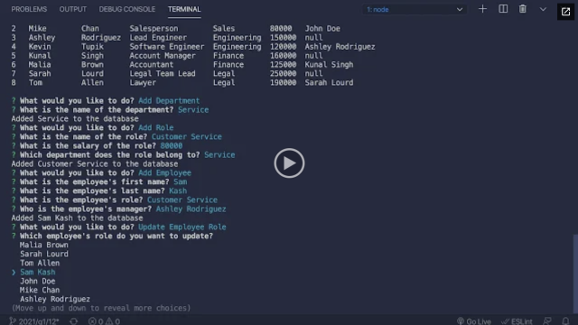

# Query-Track

## Description

Query-Track is a command line interface supported program by using inquirer. The user can read the instructions and get, insert data, and update on the following SQL tables: departments, roles, and employees. As a result, the user gains a better understanding on columns and rows in tables of an entire database.

## Table of Contents (Optional)

- [Description](#description)
- [Installation](#installation)
- [Usage](#usage)
- [Credits](#credits)
- [License](#license)
- [Badges](#badges)
- [Features](#features)
- [Contribute](#how-to-contribute)
- [Video](#video)

## Installation

run commands npm i typescript, pg, express, and inquirer.
Ensure to have package.lock.json, package.json, and tsconfig.json
click and run the localhost to bring you to website

## Usage

## Credits

No collaborators

## License

## Badges

## Features

Tons of choices to pick from to collect user input on whether to
GET, POST, PUT, AND DELETE departments, roles, and employees.
The project produces a gateway between PostgreSQL and Typescript via connection to pg with Express and Node.

## How to Contribute

Fork & Clone repo to work on any feature and make your own branch with commits and push via pull request.

## Tests

make tests folder and use command npm test

## Video

https://youtu.be/XuXzdyTUCe8
